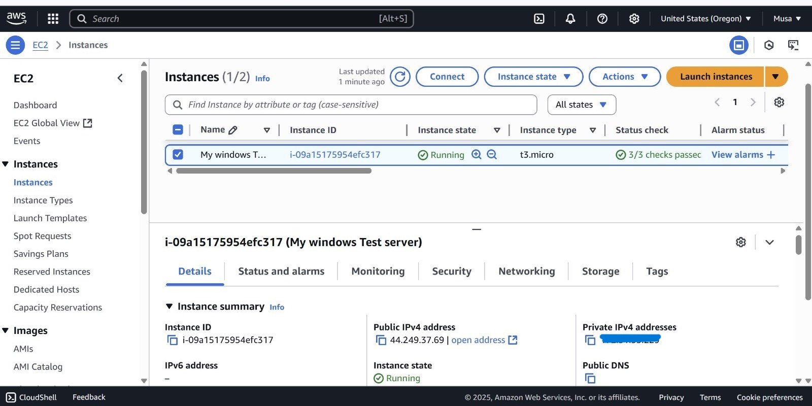

# elastic-siem-alert-automation
A cybersecurity automation project using Elastic SIEM and Tines for alert generation and response.

# Elastic SIEM Alert Automation

This project showcases a cybersecurity automation pipeline using *Elastic SIEM* and *Tines*. It demonstrates how device logs are ingested, correlated using detection rules, and how alerts are automated for analyst review and escalation.

> 📺 *Based on Tutorial:* "Try this Cybersecurity A.I Project!!" by Andrew Jones

---

## 📌 Project Objective

To build a Security Information and Event Management (SIEM) solution that:
- Collects logs from devices in a network
- Uses Elastic SIEM to detect suspicious activity
- Sends alerts to analysts via Tines
- Enables auto-escalation or rule refinement using automation

### 🖥 Step 1: Created Windows Test Server on AWS EC2

To simulate a real enterprise environment and generate security logs, I launched a *Windows Server EC2 instance* on AWS.

- Region: us-west-2 (Oregon)
- Instance Type: t3.micro (Free Tier)
- OS: Windows Server
- Purpose: This endpoint will act as a log source for Elastic SIEM

📸 Screenshot:

