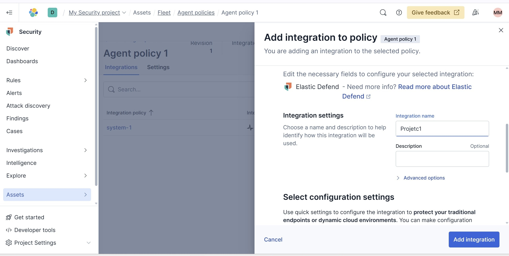

# elastic-siem-alert-automation
A cybersecurity automation project using Elastic SIEM and Tines for alert generation and response.

# Elastic SIEM Alert Automation

This project showcases a cybersecurity automation pipeline using *Elastic SIEM* and *Tines*. It demonstrates how device logs are ingested, correlated using detection rules, and how alerts are automated for analyst review and escalation.

> 📺 *Based on Tutorial:* "Try this Cybersecurity A.I Project!!" by Andrew Jones

---

## 📌 Project Objective

To build a Security Information and Event Management (SIEM) solution that:
- Collects logs from devices in a network
- Uses Elastic SIEM to detect suspicious activity
- Sends alerts to analysts via Tines
- Enables auto-escalation or rule refinement using automation

### 🖥 Step 1: Created Windows Test Server on AWS EC2

To simulate a real enterprise environment and generate security logs, I launched a *Windows Server EC2 instance* on AWS.

- Region: us-west-2 (Oregon)
- Instance Type: t3.micro (Free Tier)
- OS: Windows Server
- Purpose: This endpoint will act as a log source for Elastic SIEM

📸 Screenshot:


### 🖥 Step 2: Connected to Windows Server via Remote Desktop (RDP)

After launching the Windows EC2 instance, I established a *Remote Desktop Connection* to configure it as a log source.

🔐 This step allows access to:
- Install and configure the *Elastic Agent*
- Monitor local services and security logs
- Simulate endpoint behavior (for Elastic SIEM)

*Connection Info:*
- RDP IP: Public IPv4 address
- Username: Administrator
- Password: Decrypted using .pem key from AWS console
- Instance Type: t3.micro
- Availability Zone: us-west-2b

📸 Screenshot:


---

### ⚙ Step 3: Set Up Elastic Cloud Security & Installed Elastic Agent

After connecting to the Windows EC2 instance, I signed up for a *free trial of Elastic Cloud* with built-in Security features, which include:

#### 🛡 Elastic Security Capabilities Enabled:
- *Logs* – Collect, search, and analyze security logs from endpoints.
- *SIEM* – Detect, investigate, and respond to evolving threats.
- *Endpoint Security* – Protect hosts against malware, ransomware, and exploits via Elastic Agent.
- *Cloud Protection* – Assess cloud posture and defend workloads.

---

### ✅ Installed Elastic Agent on Windows Server

I installed the *Elastic Agent* on the Windows EC2 instance using PowerShell and enrolled it into my Elastic Cloud instance using the secure enrollment token.

📸 Screenshot:


#### 📝 Installation Commands:
```powershell
$ProgressPreference = 'SilentlyContinue'
Invoke-WebRequest -Uri https://artifacts.elastic.co/downloads/beats/elastic-agent/elastic-agent-9.0.3-windows-x86_64.zip -OutFile elastic-agent.zip
Expand-Archive .\elastic-agent.zip -DestinationPath .
.\elastic-agent.exe install --url=<elastic-cloud-url> --enrollment-token=<your-token>
---
```
### 🛡 Step 4: Integrated Elastic Defend (EDR) for Endpoint Monitoring

To enhance host-level security visibility, I integrated *Elastic Defend* with the Windows EC2 server through the *Elastic Agent Policy*.

Elastic Defend acts as an *Endpoint Detection & Response (EDR)* system, allowing:
- Real-time detection of malware, ransomware, and exploits
- Process-level telemetry and file monitoring
- Response capabilities against endpoint threats

---

### 🧩 Integration Steps:

1. Navigated to *Fleet → Agent Policies* in Elastic Cloud
2. Selected *Agent policy 1* linked to my enrolled Windows server
3. Clicked *Add integration* and chose *Elastic Defend*
4. Selected *Complete EDR (Endpoint Detection & Response)* for full visibility
5. Named the integration Project1 and applied it to the policy
6. Confirmed that the policy now contains both:
   - system-1 (basic telemetry)
   - Project1 (Elastic Defend v9.1.0)

---

📸 *Screenshots:*

- Add Integration to policy   
  

- Integration Agent selection 
  

- Configuring Integration as "Project1"  
  

- Integration Role(complete EDR)  
  

- Elastic Defend Successfully added  
  
